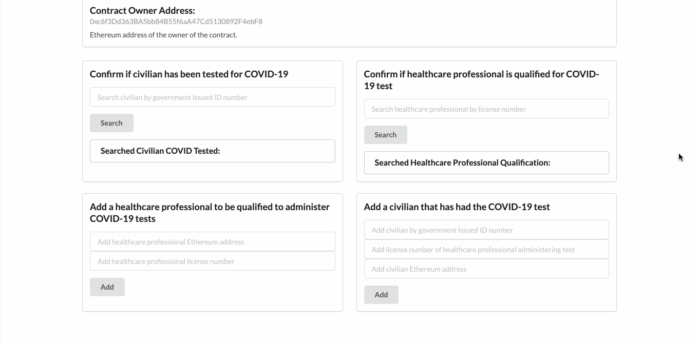
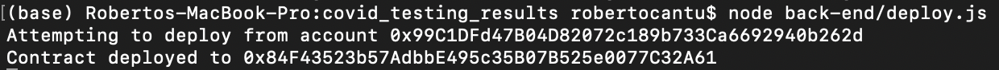

# COVID Testing Results

This project is, in essence, a database of healthcare professionals qualified to administer COVID-19 tests as well as civilians who have been tested.

Under the hood, how it functions is that the contract creator address is the only one who can submit healthcare professionals as being qualified to administer COVID tests. In the real world, how it might work is the contract creator address belongs to an organization that works in conjunction with the healthcare industry. Then, the healthcare professionals would apply to be eligible to administer the tests. This would prevent unwanted malicious actors from randomly adding civilians as having been tested. As for this particular proof of concept, the creator address would simply submit the professionals ethereum address and professional license number to be added as a qualified professional to administer COVID-19 tests. Then, a civilian could quickly verify if a certain healthcare professional is qualified to administer the tests. This is demonstrated in the gif below.


Once healthcare professionals have been added as administers of tests, they are the only ones that can add civilians as having been tested. What is provided to add civilians is the civilian’s ethereum address, government issued ID number (e.g. driver’s license number) and the qualified healthcare professional’s license number. Similar to verifying if a healthcare professional is qualified, civilians can also be searched to verify them as having been tested by a qualified professional. This is demonstrated in the gif below.



One thing to note, neither professional license number nor civilian’s government issue id number are tied to an individual’s name. Also, as to why this was built on the blockchain is because it provides assurance that the info has not been tampered with.


## Getting Started

These instructions will get you a copy of the project up and running on your local machine for development and testing purposes. See deployment for notes on how to deploy the project on a live system.

### Installing

To begin, first navigate to your desired local directory so you can clone the project repo. Once there, in the terminal, run the following command:

```
git clone https://github.com/RCantu92/covid_testing_results.git
```
Once you have cloned the project repo, run the following command to install all of the necessary dependencies:
```
npm install
```

The dependencies, along with other tools used, are listed under "Built With."

In addition to this, you will also need to install the [MetaMask](https://metamask.io/) browser extension.

## Running the tests

In the home directory, run the following in the command line:

```
npm run test
```
If all the tests are passed, you should an output similar to the following:


## Deployment

To deploy the smart contract onto the Ropsten Ethereum testnet, you would navigate back to the back-end directory and run the following in the command line:

```
node back-end/deploy.js
```

Once deployed, you should see message like the following:



To now render a local instance of contract on your browser, navigate to the root directory.

Once inside, run the following in the command line:

```
npm run dev
```

After running the above command, on your web browser navigate to [localhost:3000](http://localhost:3000/). The GIF previously shown demonstrates the process of navigating the decentralized crowd funding app.

Lastly, this contract is deployed on the ropsten testnet under address [0x84F43523b57AdbbE495c35B07B525e0077C32A61](https://ropsten.etherscan.io/address/0x84F43523b57AdbbE495c35B07B525e0077C32A61).

## Built With

* [npm](https://www.npmjs.com/) - Package manager for the JavaScript programming language.
* [Solidity, v.0.4.25](https://solidity.readthedocs.io/en/v0.4.25/) - Smart Contract programming language used.
* [JavaScript](https://developer.mozilla.org/en-US/docs/Web/javascript) - Programming language used.
* [solc, v.0.4.25](https://github.com/ethereum/solc-js) - Module for compiling the Solidity programming language.
* [dotenv](https://www.npmjs.com/package/dotenv) - Dotenv is a zero-dependency module that loads environment variables from a .env file into process.env.
* [Mocha](https://mochajs.org/) - JavaScript test framework.
* [Ganache CLI](https://www.npmjs.com/package/ganache-cli) - The command line version of Ganache, your personal blockchain for Ethereum development.
* [web3](https://github.com/ethereum/web3.js/) - This is the Ethereum JavaScript API which connects to the Generic JSON-RPC spec. Used v.1.2.9
* [Assert](https://nodejs.org/api/assert.html) - Module that provides a set of assertion functions for verifying invariants.
* [truffle-hdwallet-provider, v.1.0.35](https://github.com/trufflesuite/truffle-hdwallet-provider) - HD Wallet-enabled Web3 provider. Used to sign transactions for addresses derived from a 12-word mnemonic.
* [React](https://reactjs.org/) - JavaScript library for building user interfaces.
* [Next.js, v.9.4.4](https://nextjs.org/) - React framework.
* [MetaMask](https://metamask.io/) - Browser based wallet used to connect to the Ethereum mainnet as well as testnets.
* [Infura](https://infura.io/) - API used to access the Ethereum and IPFS networks.
* [Semantic UI React](https://react.semantic-ui.com/) - React integration for [Sematic UI](https://semantic-ui.com/).

## Authors

* **Roberto Cantu**  - [GitHub](https://github.com/RCantu92)